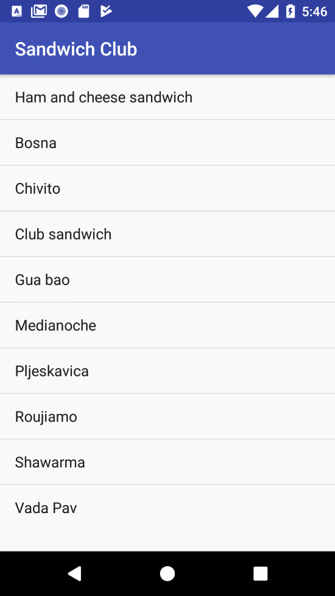
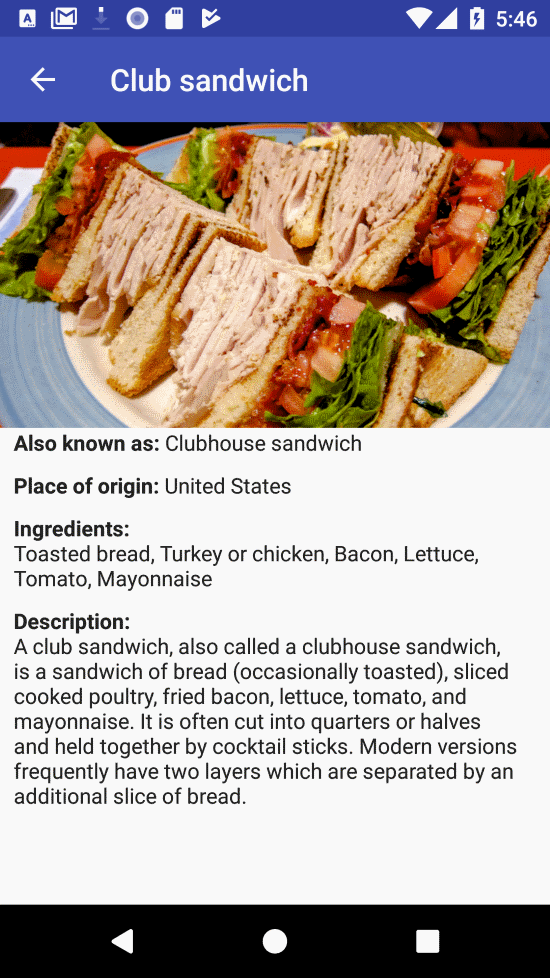

# Sandwich Club

## Project Overview

Sandwich Club is an Android app that shows you savory Sandwiches!

 &nbsp; 

I wrote this app as part of my participation in Udacity's Android Developer Nanodegree.

## How to run

1. Download [the debug apk](https://raw.githubusercontent.com/tahahojati/SandwichClub/master/app-debug.apk) to your phone.
2. Go to your phone settings and enable "installing from unknown sources"
3. Find the downloaded file and run it to install the app

Alternatively, you can clone the repo and run the app on an emulator using AndroidStudio

